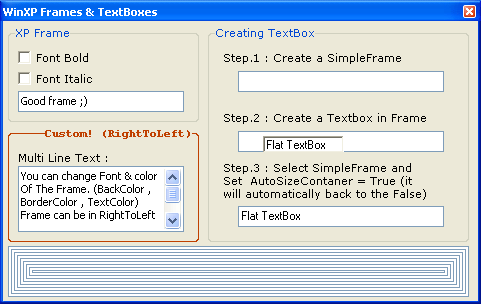



## XP Frame & Texbox \(Flat\!\)

### Description

1) Windowx XP Frame,(See ScreenShot)

2) Simple Frame for put textbox,picturebox or other thing... (It's only a frame with blue border)

Both are simple,you can change them easily (not commented good, but there's a few code, you can understand them!)

Just see ScreenShot, It's usefull!

Send Feedback, Vote!
 
### More Info
 

             |
---                |---
**Submitted On**   |2003-05-06 15:10:14
**By**             |[ali s](https://github.com/Planet-Source-Code/PSCIndex/blob/master/ByAuthor/ali-s.md)
**Level**          |Beginner
**User Rating**    |5.0 (25 globes from 5 users)
**Compatibility**  |VB 6\.0
**Category**       |[Custom Controls/ Forms/  Menus](https://github.com/Planet-Source-Code/PSCIndex/blob/master/ByCategory/custom-controls-forms-menus__1-4.md)
**World**          |[Visual Basic](https://github.com/Planet-Source-Code/PSCIndex/blob/master/ByWorld/visual-basic.md)
**Archive File**   |[XP\_Frame\_&158441562003\.zip](https://github.com/Planet-Source-Code/ali-s-xp-frame-texbox-flat__1-45301/archive/master.zip)

